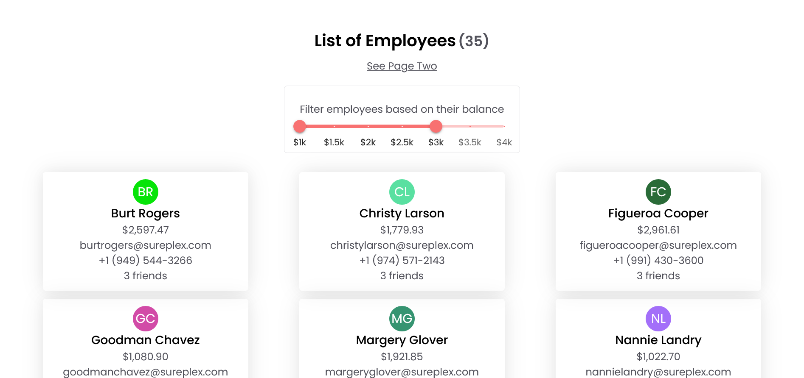
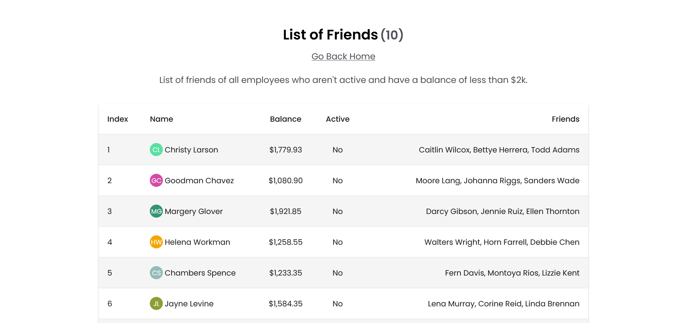

## Vitra.ai React Assessment

- This repo contains the source code for a task that was given as part of Vitra.ai's full-stack intern assessment.

- We had to design a UI where a list of employees along with their details is visible. A JSON file containing user data was shared.

- I have used MaterialUI and Styles Components for styling the app.

- It has been hosted on Netlify and is live [here](https://assignment-saket-vitraai.netlify.app)

### Screenshots


<br/> 

<br/>

### Installation

- Clone and Install Dependencies locally.
```
    git clone https://github.com/saket2508/Vitra.ai-React-Assessment.git
    cd Vitra.ai-React-Assessment
    npm install
```

### Running Locally

- from the root directory of the app, run the following command in your terminal to start the dev server.
```
    npm start
```
- It should start running on `localhost:3000`